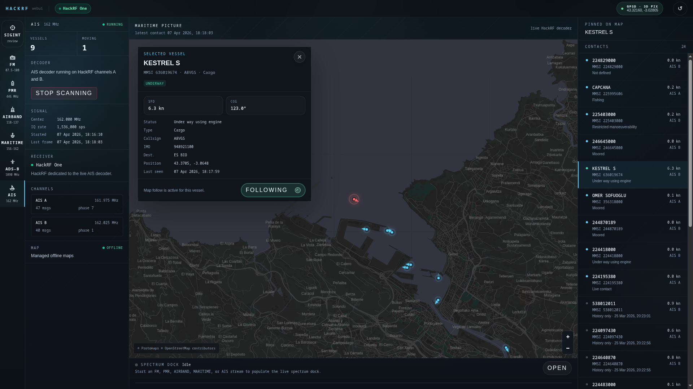
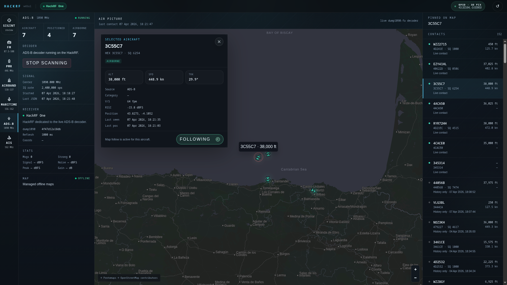
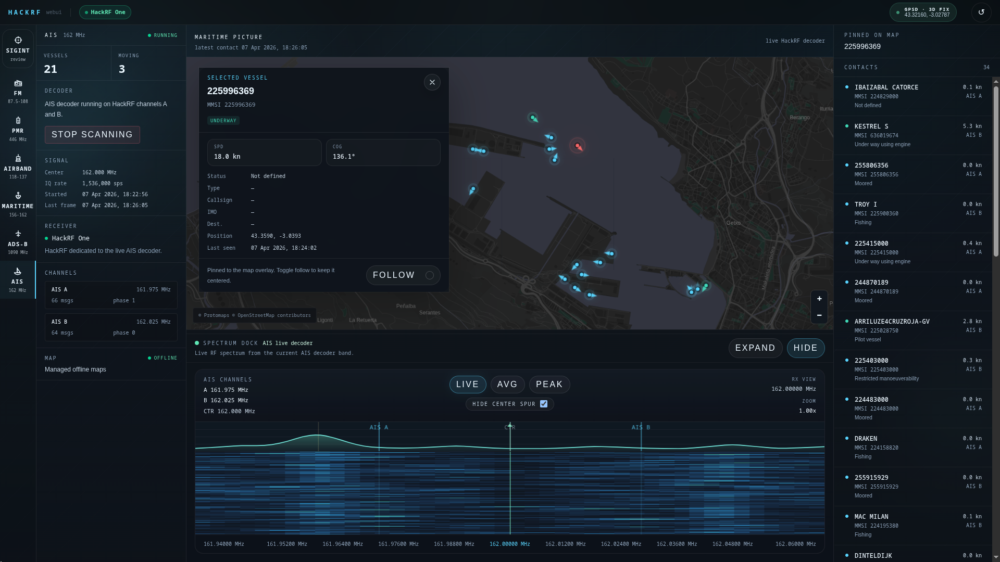
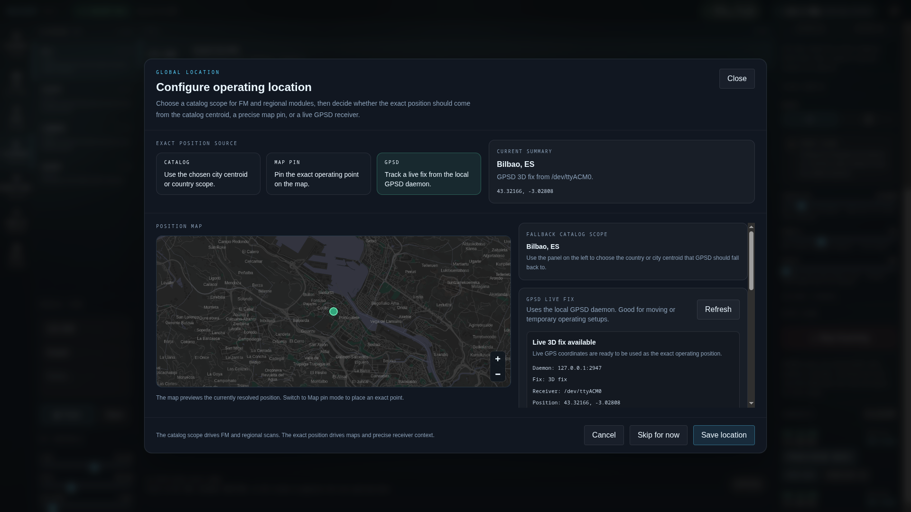

# hackrf-webui

`hackrf-webui` is a local-first web dashboard for `HackRF`: radio control, live audio, maps, capture review and offline-friendly runtime in one browser UI.

It runs on your machine. There is no cloud account, no hosted backend and no remote device bridge.

## Preview

| AIS maritime tracking | ADS-B air picture |
| --- | --- |
|  |  |
| Dual-channel AIS decoding with vessel trails, receiver status and a live RF spectrum dock. | Managed `dump1090-fa` runtime with HackRF controls, aircraft detail, receiver stats and map follow mode. |

| Offline-capable AIS map | Shared global location |
| --- | --- |
|  |  |
| Dark local basemaps, persisted vessel history and dense maritime telemetry for offline operation. | One location model shared across modules: catalog scope, exact map pin and optional live `GPSD` fixes. |

## Highlights

- Local-first HackRF dashboard built for real radio work, not a hosted demo.
- Browser audio for `FM`, `PMR`, `AIRBAND` and marine VHF voice.
- Live `AIS` and `ADS-B` maps with local history and offline-capable basemaps.
- Hardware-free simulator/replay mode for browser audio, AIS / ADS-B maps, demos and CI smoke tests.
- `SIGINT` workspace for reviewing captures, prioritizing evidence and replaying movement history.
- Shared location model: catalog scope for regional data, exact position for maps and receivers.
- Local `SQLite` storage for activity, captures, review state and decoded routes.
- Setup script that can prepare system dependencies, native receivers, maps, AI assets and the ADS-B backend.
- Redacted `/runtime` diagnostics panel for support-friendly health checks without exposing tokens or device serials.

## SIGINT workspace

`/sigint` is the analysis layer above the live radio modules. It is designed to let you leave a scanner running, come back later and review what actually happened.

It currently has three main areas:

- `Captures`: a queue of activity-triggered captures from `PMR`, `AIRBAND` and `MARITIME`, with search, module filters, review-state filters, AI-state filters, `WAV only` and `IQ only` views.
- `Evidence detail`: the selected capture, audio playback, raw `IQ` download, signal metadata, coordinates, receiver settings, local AI summary, acoustic labels, analyst notes and keep / flag / discard review state.
- `ADS-B` / `AIS` replay: persisted aircraft and vessel tracks from local history, with archive lists, offline-capable map playback, timeline scrubber, play/pause and jump-to-latest controls.

The local AI pass classifies saved audio as speech, noise, music or unknown, adds voice-activity evidence and keeps its analysis jobs visible next to the capture review.

## Modules

| Module | What it does |
| --- | --- |
| `SIGINT` | Capture queue, evidence detail, local AI triage, analyst review and AIS / ADS-B route replay. |
| `FM` | Wide FM listening with a sharded country/city station catalog and coverage metadata. |
| `PMR` | Narrowband presets, manual listen, automatic scanning and activity capture. |
| `AIRBAND` | Civil VHF airband AM listening with common/guard channels and local presets. |
| `MARITIME` | Marine VHF voice listening with global/regional starter packs and smart local scanning. |
| `AIS` | Native dual-channel HackRF decoding, vessel map, trails and persisted local history. |
| `ADS-B` | Managed `dump1090-fa` backend, aircraft map, receiver telemetry and persisted local history. |

## Quick Start

```bash
git clone git@github.com:MikelCalvo/hackrf-webui.git
cd hackrf-webui
./start.sh
```

Default address:

```text
http://127.0.0.1:3000
```

The root route opens the last module used in the browser, or falls back to `/fm`.

### Useful commands

```bash
./start.sh --check
npm run test:e2e
HACKRF_WEBUI_SIMULATOR=1 HACKRF_WEBUI_REPLAY=1 ./start.sh --skip-system-deps --skip-maps --skip-adsb-runtime --skip-ai
HACKRF_WEBUI_TOKEN="$(openssl rand -hex 32)" ./start.sh --host 0.0.0.0 --port 4000
./start.sh --map-country ES
./start.sh --skip-ai
./start.sh --skip-maps
./start.sh --rebuild
./clean.sh
```

Environment overrides work too:

```bash
HOST=0.0.0.0 PORT=4000 HACKRF_WEBUI_TOKEN="$(openssl rand -hex 32)" ./start.sh
HACKRF_WEBUI_SIMULATOR=1 ./start.sh
HACKRF_WEBUI_REPLAY=1 ./start.sh
MAP_COUNTRY=ES ./start.sh
HACKRF_WEBUI_GPSD_HOST=127.0.0.1 HACKRF_WEBUI_GPSD_PORT=2947 ./start.sh
```

For the full runtime guide, see [`docs/runtime.md`](docs/runtime.md).

No HackRF on this machine? Set `HACKRF_WEBUI_SIMULATOR=1` while developing browser-audio modules and add `HACKRF_WEBUI_REPLAY=1` when you need deterministic `AIS` / `ADS-B` map feeds. Together they provide a full offline demo path with virtual HackRF status, synthetic audio, spectrum frames, replay vessels, replay aircraft and local history endpoints.

LAN exposure is guarded: binding to a non-loopback host requires `HACKRF_WEBUI_TOKEN`. The token protects hardware-control APIs from accidental drive-by access on a trusted LAN; it is not a substitute for VPN or reverse-proxy authentication on the public internet.

## Requirements

For normal usage you need a Linux machine with:

- `HackRF` userspace tools, including `hackrf_info`
- `libhackrf` development headers
- `Node.js` `24.x` LTS
- `npm` `11+`
- `ffmpeg`, `curl`, `cc`, `pkg-config` and `ncurses` development headers

Optional:

- `gpsd` and a compatible GPS receiver for live physical positioning
- local PMTiles map packs for offline AIS / ADS-B maps

For UI and API development without physical radio hardware, `HACKRF_WEBUI_SIMULATOR=1` removes the HackRF device requirement for the browser-audio modules and makes `start.sh` build only the web bundle. `HACKRF_WEBUI_REPLAY=1` serves deterministic `AIS` / `ADS-B` vessel and aircraft fixtures through the same APIs as the live map modules.

`start.sh` can install common system dependencies on Debian/Ubuntu, Fedora/RHEL-like systems, Arch-based systems and openSUSE.

## Local data model

Runtime data stays next to the project:

- `db/app.sqlite` stores activity, review state and route history.
- `data/captures/` stores generated `WAV` and raw `IQ .cs8` evidence.
- `assets/ai/` and `runtime/` store the local SIGINT AI assets and Python runtime.
- `public/tiles/osm/` stores optional offline map layers.

The FM catalog is static and sharded under `public/catalog`; it is not stored in the database.

## Development

```bash
npm ci
npm run dev
```

Open `http://localhost:3000`.

Production-style local verification:

```bash
npm ci
npm run check
npm run build
npm run check:bundle
```

Developer notes, catalog rebuilds and data-source details live in [`docs/development.md`](docs/development.md).

## Documentation

- [`docs/runtime.md`](docs/runtime.md): install flow, runtime options, maps, storage and receiver notes.
- [`docs/development.md`](docs/development.md): development commands, native binaries and catalog tooling.
- [`docs/release.md`](docs/release.md): release checklist and verification flow.
- [`SECURITY.md`](SECURITY.md): API token, LAN exposure and vulnerability reporting policy.
- [`CONTRIBUTING.md`](CONTRIBUTING.md): local setup, verification and PR expectations.
- [`docs/fm`](docs/fm): FM coverage planning and source notes.
- [`docs/screenshots`](docs/screenshots): screenshots used by this README.

## License

Licensed under the [ISC License](LICENSE.md).
